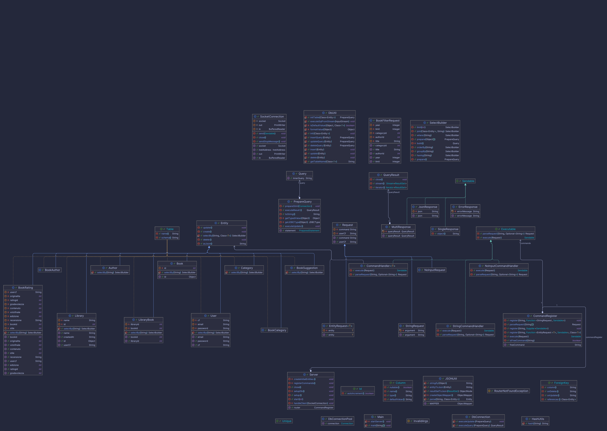
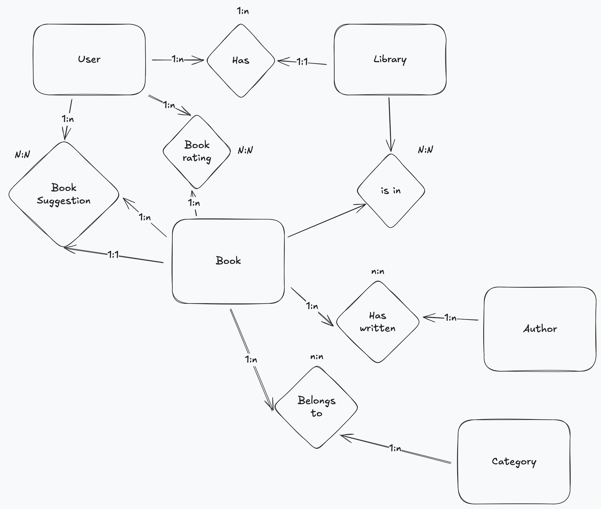

# progetto_lab_b

### UML



### ER Diagram



### Prerequisites:
- Java 21
- Postgres 16

### Setup:
1. Create a database in Postgres or execute the docker container:
```bash
cd backend
docker compose up
```

### Execution:

Go to bin:
```bash
cd bin
```

Backend:
```bash
java -jar backend.jar
```

Frontend:
```bash
java -jar frontend.jar
```
